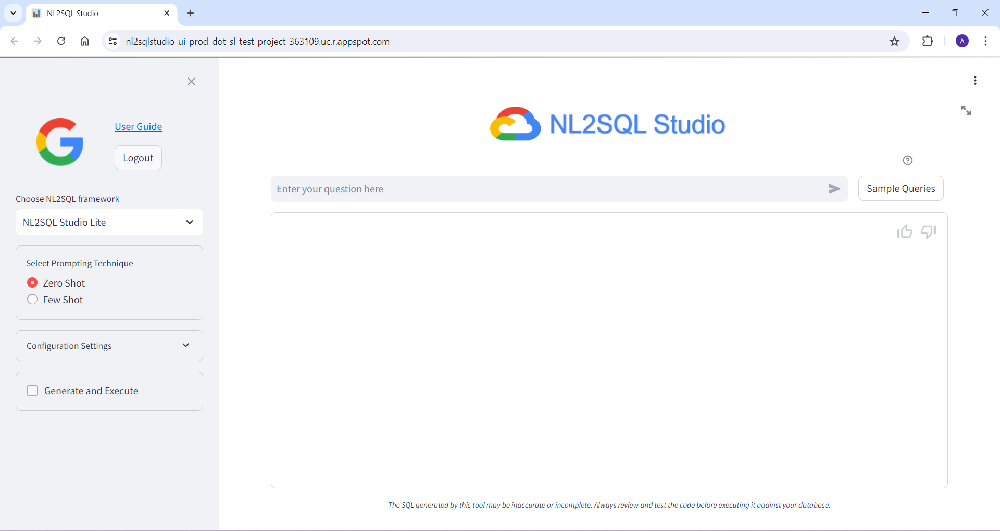
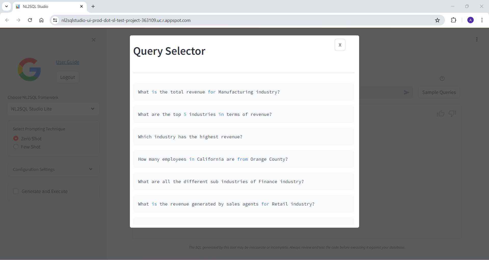
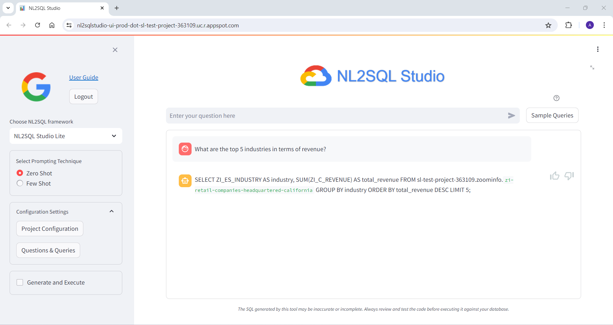

# Your One-Stop Workshop for Natural Language to SQL Experimentation

NL2SQL Studio is a comprehensive, open-source toolkit designed to empower developers, data scientists, and analysts in exploring Natural Language to SQL (NL2SQL) and creating production grade NL2SQL pipelines.  Whether you're a seasoned practitioner or just starting out, NL2SQL Studio provides an intuitive interface and a robust set of features to streamline your NL2SQL development workflow.

## Setting up NL2SQL Studio

### Setup

1. **Cloning the repository**

    ``` 
    git clone https://github.com/GoogleCloudPlatform/nl2sql-studio.git
    ```

2. **NL2SQL Modules**

| Sl. No | Module | Description |
|---|---|---|
| 1 | NL2SQL Studio Core | Library code for generating SQL using Vertex AI |
| 2 | NL2SQL Studio Lite | Library code for generating SQL using Vertex AI |
| 3 | User Interface | User interface developed using Streamlit |


3. **Deployment Order**
| Sl. No | Module | Why |
|---|---|---|
| 1 | NL2SQL Studio Core | URL of the APIs exposed by this module/service is required to be mentioned in the .env file while deploying the UI |
| 2 | NL2SQL Studio Lite | URL of the APIs exposed by this module/service is required to be mentioned in the .env file while deploying the UI |
| 3 | User Interface | Config.ini and .env files need to be updated with the API endpoints and Google Client IDs & secrets |

## Executing the NL2SQL Studio Core - Backend


**Prerequisite files**

* app.yaml
* app.py (this will contain the APIs exposed by the backend)
* Wrapper files
* Poetry.lock
* pyproject.toml


Open a new terminal

Navigate to **nl2sql_library** folder

To validate and ensure library dependencies are resolved, create a new Python env, activate the virtual env.  Before running the below steps navigate to nl2sql_library folder in your local

    ```
    python3 -m venv myenv

    source ./myenv/bin/activate
    ```

**Let’s install the dependencies**

    ```
    pip install poetry

    poetry install
    ```

Poetry will install the library dependencies based on the poetry.lock file that is present in the folder.

**Verify the installation by executing the samples**
[ Sample Executors are in the /sample_executors folder ]

Navigate to the sample_executors folder and try any of the following

    ```
    poetry run python linear_executor.py

    poetry run python cot_executor.py

    poetry run python rag_executor.py
    ```


**Alternatively, you can run the wrapper class in the main folder like so**

    ```
    poetry run python nl2sql_lib_executors.py linear

    poetry run python nl2sql_lib_executors.py cot

    poetry run python nl2sql_lib_executors.py rag
    ```

‘**linear**’, ‘**cot**’, ‘**rag**’ are the type of executors for Linear, Chain of Thought and RAG executors respectively.  Default executor type is ‘linear’ if no executor type is specified as arguments

### Launching the NL2SQL Studio Core service locally

1. Starting the backend as a local service

    * On the terminal window, navigate to **nl2sql_library** folder
    * Type the below command

    ```
    poetry run gunicorn --workers 1 --threads 8 --timeout 0 app:app
    ``` 

    This will start the local service and starts listening to API requests in the http url given as output. Sample output below

    

    Note the URL mentioned in the Listening at line - underlined URL.  This will be the URL and port number where the service will be listening for local API requests

2. Testing the local service

    * Open a new terminal window
    * Navigate to **nl2sql_lbrary** folder
    * Open **test.py** and change the URL variable to local host address noted above.  It will be like **http://127.0.0.1:8000".  Sometimes the port number may be different which will be shown as output of above command
    * Run the test.py file

    ```
    python test.py
    ```

    This will call the APIs for generating the SQL using Linear, Chain-of-Thought, RAG executors.  In one pass, it generates only the SQLs and in second pass it generates and executes the SQL as well.  Output will be as shown below

    

3. You can also test the service from the python interpreter as well

    On terminate, type python to open the interpreter

    Import libraries and call APIs.  Sample output of 2 APIs (1 GET and 1 POST) calls made along with the output is shown below

    


### Deploying the NL2SQL Studio Core Service on App Engine

1. Creating requirements.txt from Poetry installation

    Launching this setup on App Engine requires multiple commands in the entry point and ATM  this causes problems launching the app. As a workaround we create requirements.txt file from the Poetry virtual env and specify one command for launching the app.  To create requirements.txt, 

    Go back to **nl2sql_library** folder and run below command

    ```
    poetry export --without-hashes --format=requirements.txt > requirements.txt
    ```

    This file is important while deploying on App Engine as the libraries are downloaded and installed on App Engine env.  Any issues with installing the libraries during App engine deployment will cause the app to not launch.


2. Verify library dependencies from requirements.txt

    * Create a new virtual environment
    * Activate the new environment
    * install the dependencies from the requirements.txt file using the following command

        ```
        pip install -r requirements.txt
        ```

    * Validate the environment by executing the sample executors as mentioned above

3. Deploy on App Engine

    To deploy on App Engine, ensure you have app.yaml in the root folder of the service which you want to deploy.  Modify the service name in app.yaml in case required.  Other parameters in the file need not be changed

    Optional steps (Steps 1,2 & 3 below are optional if you have already performed this)

    1. Install **gcloud** on your system from  https://cloud.google.com/sdk/docs/install
    
    2. Authenticate using gcloud using

        ```
        gcloud auth login
        ```
    
        and follow the prompts to authenticate

    3. Set the project

        ```
        gcloud config set project <your project id>
        ```

    4. Use below command to increase timeout on app engine (optional, but run this command if the deployment timeout for default setting) 

        ```
        gcloud config set app/cloud_build_timeout 2000
        ```

        
        
        2000 indicates the number of seconds allowed for deployment.  This can be increased to ensure library installation completes during App engine deployment.

    5. If you have the python library packages installed in the same folder (services root folder - for ex: nl2sql_library)

        * Create a new file named **.gcloudignore**
        * mention the folder name in that file

            

        This is similar to .gitignore and does not upload the python library packages to App Engine.  Required libraries are installed during deployment based on the requirements.txt file. Else the deployment time might be too high and timeout.

    6. From the services folder which is being deployed here in this case it will be the **nl2sql_library** folder in your local , deploy the service using below command 

        ```
        gcloud app deploy
        ```

        **Note** : If this is the first service on App Engine, the service should be named ‘default’ in app.yaml file. You can only use a custom name if you have a default service deployed.

        Output of the command will be as shown

        

        **Note**- if you see Uploading files are 1000+ there is probably something wrong with your .gcloudignore file. Please stop deployment and review above step 5

Once deployed, the service will be available on App Engine Services list as shown below


After deployment, on App Engine Services screen, click on the Service.  This will open a new browser tab and perform a GET operation on the default route. If you see a response on browser window as shown below, the deployment is successful


Modify the test.py file and update the URL to the App Engine deployed service endpoint.  For ex.

https://nl2sql-lib-executors-p2r-dot-sl-test-project-363109.uc.r.appspot.com

Execute the file to validate the deployment of the library on backend.

Note the App Engine endpoint for this service as this is required to be updated in the .env file for CORE_EXECUTORS of UI module


## Executing the NL2SQL Studio Lite - Backend

**Prerequisite files**

* app.yaml
* app.py (this will contain the APIs exposed by the backend)
* Wrapper files

Open a new terminal

Navigate to **nl2sql_src** folder

To validate and ensure library dependencies are resolved, create a new Python env, activate the virtual env.  Before running the below steps navigate to nl2sql_library folder in your local

```
python3 -m venv myenv

source ./myenv/bin/activate
```

**Let’s install the dependencies**

```
pip install -m requirments.txt
```


### Launching the NL2SQL Studio Lite service locally

1. Starting the backend as a local service

    * On the terminal window, navigate to **nl2sql_src** folder
    * Type the below command

    ```
    gunicorn --workers 1 --threads 8 --timeout 0 app:app
    ``` 

    This will start the local service and starts listening to API requests in the http url given as output. Sample output below

    

    Note the URL mentioned in the Listening at line - underlined URL.  This will be the URL and port number where the service will be listening for local API requests

2. Testing the local service

    * Open a new terminal window
    * Navigate to **nl2sql_src** folder
    * Open **test_lite.py** and change the URL variable to local host address noted above.  It will be like **http://127.0.0.1:8000".  Sometimes the port number may be different which will be shown as output of above command
    * Run the test.py file

    ```
    python test_lite.py
    ```

    This will call the APIs for generating the SQL using Zero-shot and Few-Shot prompting techniques.  Output will be as shown below

    

3. You can also test the service from the python interpreter as well

    On terminate, type python to open the interpreter

    Import libraries and call APIs.  Sample output of 2 APIs (1 GET and 1 POST) calls made along with the output is shown below

    


### Deploying the NL2SQL Studio Lite Service on App Engine


1. Deploy on App Engine

    To deploy on App Engine, ensure you have app.yaml in the root folder of the service which you want to deploy.  Modify the service name in app.yaml in case required.  Other parameters in the file need not be changed

    Optional steps (Steps 1,2 & 3 below are optional if you have already performed this)

    1. Install **gcloud** on your system from  https://cloud.google.com/sdk/docs/install
    
    2. Authenticate using gcloud using

        ```
        gcloud auth login
        ```
    
        and follow the prompts to authenticate

    3. Set the project

        ```
        gcloud config set project <your project id>
        ```

    4. Use below command to increase timeout on app engine (optional, but run this command if the deployment timeout for default setting) 

        ```
        gcloud config set app/cloud_build_timeout 2000
        ```

        
        
        2000 indicates the number of seconds allowed for deployment.  This can be increased to ensure library installation completes during App engine deployment.

    5. If you have the python library packages installed in the same folder (services root folder - for ex: nl2sql_library)

        * Create a new file named **.gcloudignore**
        * mention the folder name in that file

            

        This is similar to .gitignore and does not upload the python library packages to App Engine.  Required libraries are installed during deployment based on the requirements.txt file. Else the deployment time might be too high and timeout.

    6. From the services folder which is being deployed here in this case it will be the **nl2sql_library** folder in your local , deploy the service using below command 

        ```
        gcloud app deploy
        ```

        **Note** : If this is the first service on App Engine, the service should be named ‘default’ in app.yaml file. You can only use a custom name if you have a default service deployed.

        Output of the command will be as shown

        

        **Note**- if you see Uploading files are 1000+ there is probably something wrong with your .gcloudignore file. Please stop deployment and review above step 5

Once deployed, the service will be available on App Engine Services list as shown below


After deployment, on App Engine Services screen, click on the Service.  This will open a new browser tab and perform a GET operation on the default route. If you see a response on browser window as shown below, the deployment is successful


Modify the test.py file and update the URL to the App Engine deployed service endpoint.  For ex.

https://nl2sqlsqlstudio-lite-p2r-dot-sl-test-project-363109.uc.r.appspot.com

Execute the file to validate the deployment of the library on backend.

Note the App Engine endpoint for this service as this is required to be updated in the .env file for LITE_EXECUTORS of UI module


## NL2SQL Studio UI

Prerequisite files:
* app.yaml
* config.ini
* .env
* nl2sqlstudio_ui.py
* utils.py
* sample_questions.csv

### Setting up UI locally

1. Create a new virtual enironment and activate the same

2. Install dependent libraries.  On terminal, navigate to **UI** folder and run

    ```
    pip install -r requirements.txt
    ```

3. Update **.env** file with the URLs noted for the above 2 services.  Do not change the key names.

        CORE_EXECUTORS - Endpoint of CORE service
        LITE_EXECUTORS - Endpoint of LITE service

4. To launch the UI locally, type

    ```
    streamlit run nl2sqlstudio_ui.py
    ```

    Streamlit output will be as shown below

    

5. Streamlit will initialize and start the server on **http://localhost:8501**

6. Open the above URL on a browser for UI


    <span style="background-color:yellow;color:black">**- NOTE -**</span>

    While launching the UI locally, ensure the following

    1. config.ini is updated with the Client ID and Client Secret (without this the Google OAuth authentication fails)
    2. GOOGLE_REDIRECT_URI is updated to redirect to local host address mentioned above (else upon Google Authentication, the browser redirects to the URL mentioned in the config.ini )
    3. Update Credetials Page (if not already done)
        
        1. Goto Credentials Page

        1. Edit the OAuth 2.0 Client ID generated for the project
        
        1. Ensure local host address long with port number is updated in both the below sections (else, local origins requests will be blocked by Google OAuth and redirection will happen to a diffferent URL or errors out as Invalid)

            1. AUTHORIZED JAVASCRIPT ORIGINS
            1. AUTHORISED REDIRECT URIs 

            

    <span style="background-color:red;color:black">**- Enabling / Disabling Google Authentication -**</span>

    To execute the UI authenticating users via Google OAuth, edit **config.ini** file and set
    
    ```
    GOOGLE_OAUTH = ENABLE
    ```
    If **GOOGLE_AUTH = ENABLE** in **config.ini** ensure you proided details for GOOGLE_CLIENT_ID and GOOGLE_CLIENT_SECRET, else the authentication will fail

    In case you want to execute the UI without enabling Google Authentication, edit **config.ini** file and set
    
    ```
    GOOGLE_AUTH = DISABLE
    ```


### Deploying the UI on App Engine

To deploy on App Engine, ensure you have app.yaml in the root folder of the service which you want to deploy.  Modify the service name in app.yaml in case required.  Other parameters in the file need not be changed
  
Optional steps (Steps 1,2 & 3 below are optional if you have already performed this)

1. Install **gcloud** on your system from  https://cloud.google.com/sdk/docs/install
    
2. Authenticate using gcloud using

        ```
        gcloud auth login
        ```
    
    and follow the prompts to authenticate

3. Set the project

        ```
        gcloud config set project <your project id>
        ```

4. Update **.env** file with the URLs noted for the above 2 services.  Do not change the key names.

        CORE_EXECUTORS - Endpoint of CORE service
        LITE_EXECUTORS - Endpoint of LITE service

5. Update **config.ini** (you will need to update this to specify the Client ID and Client secret if SSO authentication is enabled) from Credentials screen of APIs and services

6. Update sample_questions.txt (sample questions related to your dataset)

7. Goto folder where the app.yaml file is available

8. Execute the following code

    ```
    gcloud app deploy
    ```

If the deployment is successful, App Engine endpoint will be provided in the output.

This will be the URL for the UI service.  If you have deployed with a different service name, the URL will be prefixed with the service name.  For example:

**nl2sqlstudio-ui-dot-sl-test-project-363109.uc.r.appspot.com**

Below are some of the screenshots of NL2SQL Studi UI










## Bring Your Own Model

To plug-in your own NL2SQL model to the NL2SQL Studio, wrapper function and API end points need to be created

### Wrapper Function

1. Create **app.py** with the following content

    ```
    import json
    import os
    from flask_cors import CORS
    from flask import Flask, request
    from dotenv import load_dotenv
    from loguru import logger
    import uuid

    from <your library> import <import class/function>

    load_dotenv()
    app = Flask(__name__)

    cors = CORS(app)
    app.config["CORS_HEADERS"] = "Content-Type"

    @app.route("/")
    def default_route():
        """
        Default API Route - GET API
        """
        return json.dumps({"response": "<your welcome message>"})


    # Below function and annotation creates one route to
    # your model to serve the SQL generation request
    # Endpoint will be 
    # <your deployment path>/api/<yourmodel>/generate

    @app.route("/api/<yourmodel>/generate", methods=["POST"])
    def generate_sql_from_nl():
        """
        Invoke your model's SQL Generation functions here

        'question', 'execute_sql', 'few_shot' are the parameters
        that should be sent in the API call

        question : string
            NL statement for which SQL should be generated
        execute_sql : boolean
            Option to execute the SQL and return the NL
            summary of the result
        few_shot : boolean
            Option to use Few-shot prompting or not.  This
            is an optional field, you can choose to ignore
            this field as required
        """

        # Following line extracts the API request parameters
        # and saves to variables for further processing

        question = request.json["question"]
        execute_sql = request.json["execute_sql"]
        few_shot = request.json["few_shot"]

        <your processing logic to generate the SQL>

        # Below is the API response structure.  If this is
        # altered, UI will fail.  Ensure this response 
        # structure is maintained

        # res_id : string
        #    Generate res_id using the UUID library 
        #    This res_id is required to update user feedback
        #    if the option to capture feedback is enabled
        #    in your library.  Else, this can be any dummy
        #    string

        # sql : string
        #    Generated sql from your processing logic

        # sql_result : string
        #    Executed SQL result processed by LLM
        #    to generate NL summary of the result

        # error_msg : string
        #    Blank if the SQL execution is successful and
        #    NL summary of result is generated
        #    Appropriate error message if the SQL execution
        #    fails.  If execution fails, sql_result field
        #    should be blank

        response_string = {
                "result_id": res_id,
                "generated_query": sql,
                "sql_result": sql_result,
                "error_msg": "",
            }

        return json.dumps(response_string)

    # Create additonal routes to your service as required
    # based on the above template

    if __name__ == "__main__":
        app.run(debug=True, port=5000)

    ```

2. Create a **test.py** file like below

    ```
    import json
    import requests

    URL = "http://127.0.0.1:8000/"

    def test_sql_generation(question, execute_sql, few_shot_gen):
        end_point = f"{URL}api/<yourmodel>/generate"
        # <yourmodel> should be what you have given as 
        # route in the app.py file above

        data = {"question": question,
                "execute_sql": execute_sql,
                "few_shot": few_shot_gen}

        headers = {"Content-type": "application/json",
                   "Accept": "text/plain"}

        resp = requests.post(
            url=end_point,
            data=json.dumps(data),
            headers=headers,
            timeout=None
            )
        print("Lite API response =", resp.json())

    def default_route_test():
        """
        Sample test
        """
        resp = requests.get(URL, timeout=None)
        r = resp.json()
        print(resp, r)

    if __name__ == "__main__":
        
        # Verify whether the resonse string is returning
        # the same string  as <your welcome message>
        # in default_route function in app.py
        response = default_route_test()
        print(response.json())

        QUESTION = "<your NL statement to generate SQL>

        # Invoke the SQL Generator to only generate SQL with 
        # Zero shot prompting

        test_sql_generation(QUESTION, FALSE, FALSE)

        # Invoke the SQL Generator to generate SQL and execute with Zero shot prompting

        test_sql_generation(QUESTION, TRUE, FALSE)

        # Invoke the SQL Generator to generate SQL and execute with Few shot prompting

        test_sql_generation(QUESTION, TRUE, TRUE)

    ```


3. Open a new terminal and navigate to the folder where the **app.py** and **test.py** is located.  Run the following command to launch the service locally

    ```
    gunicorn --workers 1 --threads 8 --timeout 0 app:app
    ```

    This will start the local service and starts listening to API requests in the http url given as output. Sample output below

    

4. Open another terminal and navigate to the folder where the **app.py** and **test.py** is located.  Run the test.py to verify whether the API routes and functionality is working fine

    ```
    python test.py
    ```

5. If the testing the successful, you can deploy the service to App Engine by following the **Deploying on App engine** section mentioned above

6. Note the deployment endpoint where the service is deployed

7. Go to UI folder, and modify the **.env** file to update the path for LITE_EXECUTORS with your service endpoint and launch the UI locally or deploy to App engine as mentioned in the **NL2SQL Studio UI** section above
