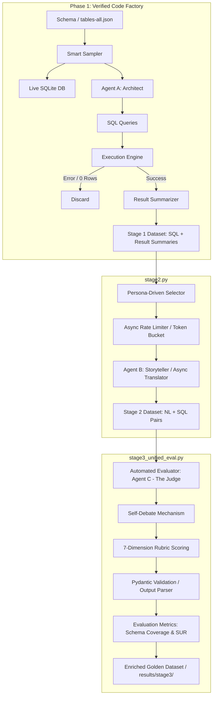

# NL2SQL Golden Dataset Generator

## Overview
This project implements an automated, multi-agent pipeline designed to generate high-quality, verified Natural Language to SQL (NL2SQL) query pairs. By validating generated queries against a live database and employing LLM-based evaluation, the system creates a diverse "Golden Truth Dataset." This curated data is optimized for fine-tuning models on complex text-to-SQL tasks and provides a rigorous foundation for benchmarking model performance.



---

## Phase 1: Verified Code Factory (Stage 1)
The goal of this initial phase is to generate syntactically correct and executable SQL queries directly from a target database schema.
* **Smart Sampler:** Ingests the database JSON Schema and iterates through it table-by-table to ensure comprehensive domain coverage.
* **Agent A (Architect):** Generates valid SQL queries across varying levels of complexity (*Simple, Medium, Complex*).
* **Execution Engine:** The generated SQL is executed directly against the live database. Any queries that result in execution errors or return 0 rows are immediately discarded.
* **Result Summarizer:** For successful queries, an LLM analyzes the output and creates a summary describing the "shape" and context of the retrieved data.

---

## Phase 2: Context-Aware Translation (Stage 2)
This phase bridges the gap between the verified technical code and human intent, effectively reverse-engineering the user prompt.

The core logic resides in `stage2.py` and is asynchronously executed by the runner `run_stage2_async.py`.

### 1. The Smart Sampler
To ground translations in reality and avoid hallucination, the `SmartSampler` does the following:
* Loads schemas from a master database definition file (`tables-all.json`).
* Connects directly to the corresponding live SQLite database (`db_id.sqlite`).
* Inspects all tables, column names, and extracts **up to 3 sample rows** per table to represent actual domain values.
* Formats these schemas and samples into readable context blocks for the LLM.

### 2. Persona-Driven Translation Framework
To ensure linguistic diversity and represent real-world business query patterns, every query in the dataset is translated through the lens of one of five distinct user personas:

| Persona | Core Focus / Domain Area | Example Question Pattern |
| :--- | :--- | :--- |
| **The Executive** | High-level KPIs, trends, financial health, macro stats | *"How is our Q3 revenue looking?"* |
| **The Engineering Manager** | Operational status, ticket backlogs, blocker patterns, infrastructure issues | *"List tickets blocked by infra issues"* |
| **The Data Analyst** | Precise filtering, aggregations, rankings, top cuts, grouped analysis | *"Select top 5 users by spend, grouped by region"* |
| **The Product Manager** | User engagement, feature adoption, cohort analysis, active usage metrics | *"How many active users engaged with the new dashboard last week?"* |
| **The Customer Support Lead** | Ticket resolution times, support queues, ticket severity stats | *"What is the average resolution time for severity 1 tickets this month?"* |

### 3. Prompt Engineering & Prompt Structure
The `build_system_prompt` function constructs a highly constrained, unified system prompt for the translation agent:
* **Persona Injection:** Embeds the assigned persona's name and description to align the tone.
* **Ground Truth Context:** Passes the SQL query and optionally binds the corresponding **Database Schema** (with samples) and the expected **Result Summary**.
* **Guidelines & Constraints:**
  1. *Exact Match:* Re-translates the question matching strict SQL conditions (e.g., limits, orderings).
  2. *Persona Alignment:* Uses the specific tone and vocabulary of the assigned persona.
  3. *No Hallucinations:* Forbids inventing filter constraints not logically present in the SQL.
  4. *No Open-Endedness:* Avoids generic inquiries if the underlying result set is small or bounded.
* **Format Restriction:** Mandates output to be a JSON array of strings of exactly the same length as the batch size (no markdown wrappers, conversational text, or filler).

### 4. Async Orchestration & Rate Limiting (`run_stage2_async.py`)
To process large datasets efficiently while complying with Gemini API constraints:
* **Token-Bucket Async Rate Limiter:** Implements a custom `AsyncRateLimiter` class regulating Queries Per Minute (QPM) using token bucket replenishment logic.
* **Async Translator Agent:** Employs the modern `google-genai` SDK via `Client.aio` for asynchronous API calls (`aio.models.generate_content`), using `gemini-2.5-flash`.
* **Fault Tolerance:** Features robust exception handling and an exponential backoff retry algorithm (up to 10 retries) specifically tuned for `429 (RESOURCE_EXHAUSTED)` and quota-based failures.
* **Execution Flow:**
  1. Loads successful records from Stage 1 (`success = True`).
  2. Randomly assigns each record to a target persona.
  3. Batches records (batch size = 10) per persona.
  4. Evaluates batches concurrently using `asyncio.gather`.
  5. Saves the final translated dataset directly to `results/stage2/` with the schema `db_id`, `complexity`, `sql`, `result_summary`, `schema`, `persona`, and `nl_question`.

---

## Phase 3: The Quality Gate (Stage 3)
Stage 3 acts as an automated curator and quality controller. Using the state-of-the-art `gemini-2.5-pro` model, it subjects each generated query pair to a comprehensive multi-dimensional evaluation.

The core evaluator is located in `stage3_unified_eval.py` and orchestrated via `run_stage3.py`.

### 1. Multi-Dimensional Scoring Rubric
Every generated question is evaluated on a strict **1 to 5 scale** across **7 quality dimensions**:

1. **Technical Accuracy (SQL Translation):** Captures all SQL logic, clauses, aggregations, groupings, ranges, limits, and joins.
2. **Schema Adherence:** Perfect utilization of tables, column names, and domain concepts logically present in the database.
3. **Groundedness (Result Shape):** Explicitly asks for the exact output shape described in the expected Result Summary (e.g., asking for "Top 3" when a query has `LIMIT 3`).
4. **Persona Alignment:** Alignment of the tone, terminology, and depth of business insights with the assigned persona description.
5. **Conciseness & Clarity:** Straight-to-the-point phrasing, free of conversational filler (e.g. "please," "thank you") or meta-text ("Here is the query to...").
6. **Information Density and Clarity (IDC):** Direct, unambiguous, and natural human inquiry vs. mechanical, robotic, clause-by-clause translations (e.g., *"Select the count of users where status is active"*).
7. **Fluency:** Grammatical perfection and natural syntax.

### 2. Self-Debate Mechanism
To mitigate positive model bias, the evaluator is instructed to execute a **Self-Debate step** before scoring:
* The model must explicitly argue at least one reason why the generated question might be technically inaccurate, robotic, vague, or missing a constraint.
* This "Devil's Advocate" constraint significantly improves the reliability and objectivity of the assigned scores.

### 3. Pydantic Structural Enforcement
The evaluator uses Pydantic schemas to strictly validate and structure JSON responses received from Vertex AI:
* `CategoryEvaluation`: Enforces that every grading category includes a `passed` flag (True if score $\ge$ 4), a numeric `score` (1-5), and a detailed text `details` explanation.
* `GenAIReport`: Groups the `self_debate` text, the 7 custom category evaluation reports, and the aggregated `genai_total_score` (out of 35).
* `BatchEvaluationReport`: Wraps a list of `GenAIReport` objects to guarantee a 1:1 mapping between input records and evaluations in batched requests.

### 4. Concurrent Pipeline Orchestration (`run_stage3.py`)
* **Golden Context Generation:** Dynamically constructs an evaluation key for each record, including the original schema, target persona, original SQL, and result summary.
* **Batched Concurrency:** Chunks records into small batches (batch size = 5) and processes them using a parallel `ThreadPoolExecutor` across a configurable number of threads (default = 5 workers).
* **Graceful Failures:** Automatically defaults missing or failed batch evaluation reports to `None` while preserving execution across other threads.

---

## Execution Guides

### 1. Running Stage 2 (Context-Aware Translation)
To run Stage 2 and generate natural language questions asynchronously:
```bash
python synthetic_data_gen/experiment_runners/run_stage2_async.py \
  --input ./results/stage1/s1_flash_output.json \
  --qpm 60
```
* **`--input`**: Path to the output file generated by Stage 1.
* **`--qpm`**: Queries Per Minute limit to regulate API access (defaults to 60).
* **`--output`** (Optional): Output path for the Stage 2 results (defaults to a auto-timestamped file in `results/stage2/`).

### 2. Running Stage 3 (Automated Evaluation & Analytics)
To run Stage 3 evaluation and calculate coverage/uniqueness:
```bash
python synthetic_data_gen/experiment_runners/run_stage3.py \
  --input ./results/stage2/s2_flash_output_questions.json
```
* **`--input`**: Path to the Stage 2 output JSON file.
* **`--output`** (Optional): Path to save evaluated output JSON file (defaults to an auto-timestamped file in `results/stage3/`).
* **`--model`** (Optional): Generative model name (defaults to `gemini-2.5-pro`).
* **`--batch-size`** (Optional): Number of records evaluated per LLM call (defaults to 5).
* **`--max-workers`** (Optional): Number of parallel threads (defaults to 5).


The script will print out:
   * **Average scores by query complexity** (Simple, Medium, Complex) out of 35.
   * **Average scores by grading category** out of 5.
   * **Average Schema Coverage** percentage and detailed per-DB coverage.
   * **Average SQL Uniqueness Rate (SUR)** and detailed per-DB uniqueness.
   * Saves the complete evaluation reports inline inside the final dataset under `results/stage3/`.